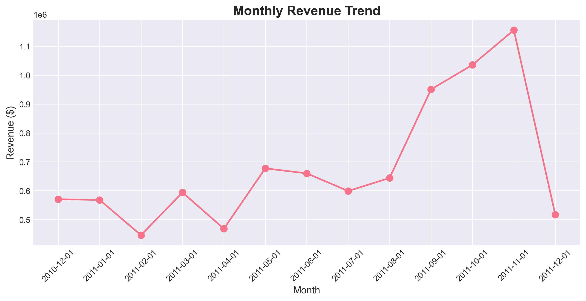
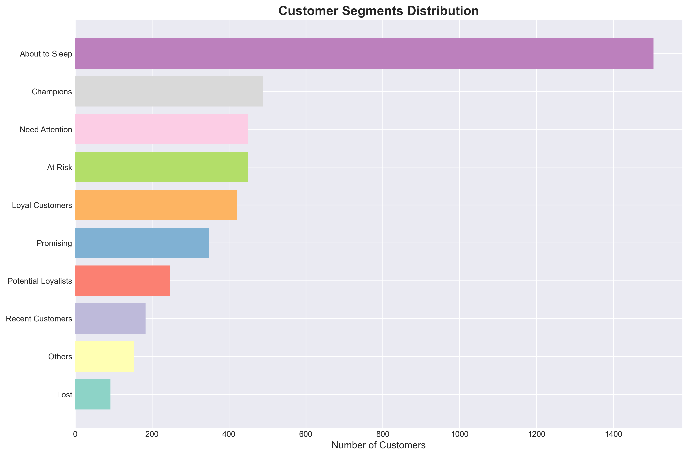
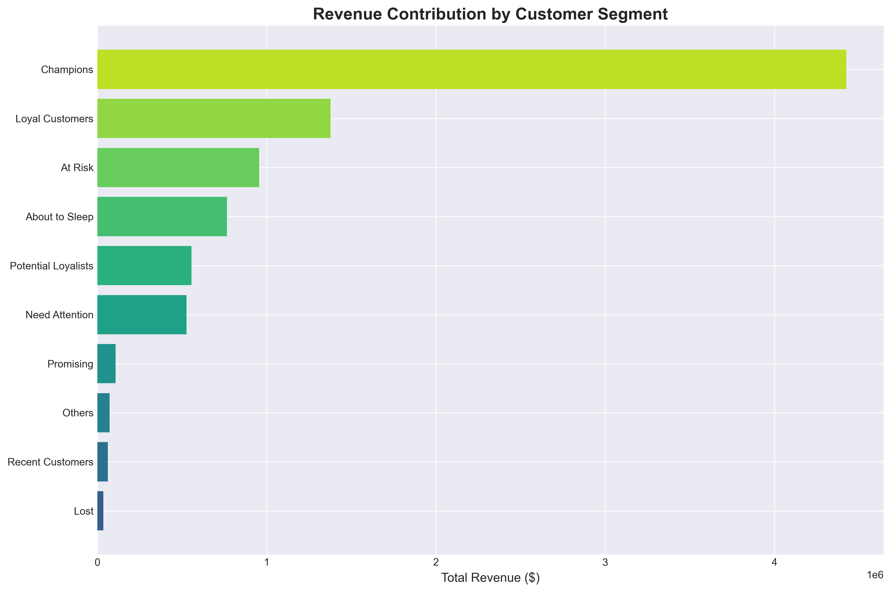
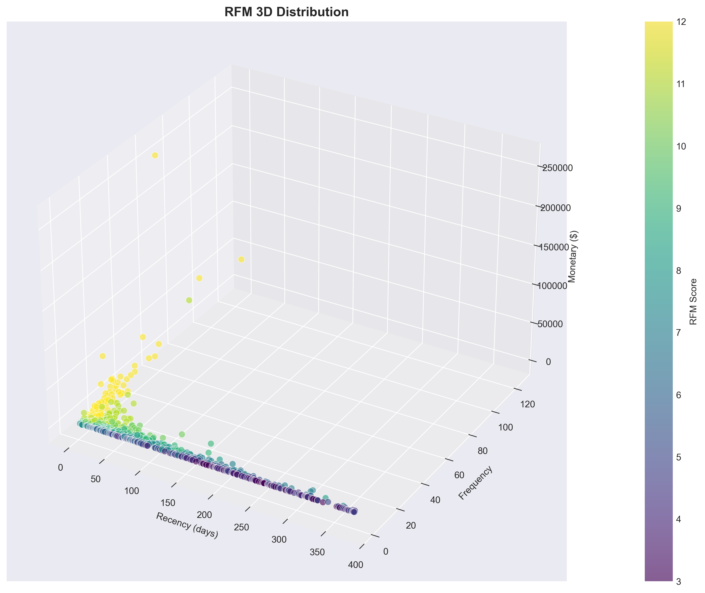

# 🛒 E-Commerce Customer Analytics & Segmentation


## 📌 Project Overview

This project analyzes **540K+ e-commerce transactions** to understand customer purchasing behavior, revenue contribution, and customer value. Using **Python** and **RFM (Recency, Frequency, Monetary) analysis**, customers are segmented into actionable groups to support **retention strategies** and **targeted marketing decisions**.

The project is designed as an **end-to-end Data Analyst portfolio project**, covering data cleaning, exploratory data analysis, customer segmentation, and business insights.

---

## 🎯 Objectives

* Analyze large-scale e-commerce transaction data
* Identify revenue patterns and customer behavior
* Segment customers based on RFM methodology
* Detect high-value and churn-risk customer groups
* Provide data-driven insights for marketing and retention

---

## 📊 Dataset

* **Source**: [Online Retail Dataset - Kaggle](https://www.kaggle.com/datasets/ulrikthygepedersen/online-retail-dataset)
* **Records**: 541,909 transactions
* **Customers**: 4,338 unique customers
* **Countries**: 38
* **Period**: December 2010 - December 2011
* **Total Revenue**: $8,887,209

### Key Fields

| Column | Description |
|--------|-------------|
| InvoiceNo | Invoice number (6-digit) |
| CustomerID | Unique customer identifier |
| InvoiceDate | Transaction date and time |
| StockCode | Product code |
| Description | Product name |
| Quantity | Quantity per transaction |
| UnitPrice | Product price per unit (GBP) |
| Country | Customer's country |

---

## 🗂️ Project Structure

```
online-retail-analysis/
│
├── data/
│ ├── raw/
│ │ └── online_retail.csv
│ └── processed/
│ ├── online_retail_cleaned.csv
│ ├── rfm_customer_segmentation.csv
│ └── segment_summary.csv
│
├── notebooks/
│ ├── 01_data_cleaning.ipynb
│ ├── 02_exploratory_data_analysis.ipynb
│ └── 03_rfm_customer_segmentation.ipynb
│
├── dashboard/ # (optional – for Streamlit dashboard)
├── outputs/ # charts, figures, exports
├── requirements.txt
└── README.md
```

---

## 🔍 Analysis Workflow

### 1️⃣ Data Cleaning (`01_data_cleaning.py`)

**Actions Taken:**
* Removed **135,672 cancelled transactions** (InvoiceNo starting with 'C')
* Handled **25% missing CustomerIDs** (135,080 records)
* Filtered out negative/zero quantities and prices
* Created revenue feature: `TotalPrice = Quantity × UnitPrice`
* Engineered temporal features: Year, Month, Day, Hour, DayOfWeek

**Result:** Cleaned dataset reduced from **541,909 → 395,237 records** (27% data cleaning)

### 2️⃣ Exploratory Data Analysis (`02_eda.py`)

**Analysis Performed:**
* **Revenue trends** over time (monthly, daily, hourly patterns)
* **Geographic analysis**: Top countries by revenue and transactions
* **Product analysis**: Best-selling products and revenue contributors
* **Customer behavior**: Purchase frequency, order value distribution
* **Cohort analysis**: Customer retention rates over time

**Output:** 9 comprehensive visualizations

### 3️⃣ RFM Customer Segmentation (`03_rfm_segmentation.py`)

**Methodology:**
* Calculated **Recency** (days since last purchase)
* Calculated **Frequency** (number of transactions)
* Calculated **Monetary** (total spending)
* Scored customers using **quantile-based RFM scoring** (1-4 scale)
* Segmented into **11 actionable customer groups**

**Segments Identified:**
* 🏆 Champions (best customers)
* 💎 Loyal Customers
* 🌟 Potential Loyalists
* 🆕 Recent Customers
* ⚠️ Need Attention
* 🚨 At Risk
* 🆘 Can't Lose Them
* ❄️ Hibernating
* ⛔ Lost

**Output:** 6 RFM visualizations including 3D scatter plot

---

## 📈 Key Insights

### Business Metrics
```
💰 Total Revenue:        $8,887,209
🛒 Total Transactions:   18,532
👥 Total Customers:      4,338
💵 Avg Order Value:      $479.56
📦 Unique Products:      4,070
```

### Critical Findings

#### 1. Revenue Concentration
* **Top 10% customers** contribute **43% of total revenue** ($3.8M)
* **Top 20 products** generate **35% of total sales**
* Customer value follows power law distribution

#### 2. Customer Segments (RFM Results)
| Segment | Count | % of Base | Revenue | % of Total |
|---------|-------|-----------|---------|------------|
| Champions + Loyal | 892 | 21% | $3.2M | 36% |
| Potential Loyalists | 687 | 16% | $1.1M | 12% |
| At Risk + Hibernating | 1,247 | 29% | $1.8M | 20% |
| Lost Customers | 653 | 15% | $0.4M | 5% |

**Key Takeaway:** Small group of high-value customers drives majority of revenue

#### 3. Geographic Insights
* **UK dominates**: 82% of total revenue ($7.3M)
* **Top international markets**: Netherlands, EIRE, Germany, France
* **High AOV markets**: Germany ($512), France ($498)
* **Expansion opportunity**: Germany & France show strong engagement

#### 4. Temporal Patterns
* **Peak month**: November 2011 ($850K revenue)
* **Best day of week**: Thursday (average $198K/day)
* **Peak hours**: 12 PM - 2 PM (lunch time)
* **Business model**: B2B wholesale (Monday-Friday only, no Saturday operations)
* **Seasonality**: Strong Q4 performance, revenue dip in June

#### 5. Product Performance
* **Top product**: "PAPER CRAFT, LITTLE BIRDIE" ($168K revenue)
* **High volume**: "MEDIUM CERAMIC TOP STORAGE JAR" (80K units sold)
* **Average order size**: 22 units (bulk wholesale orders)

---

## 💡 Business Recommendations

### Priority Actions

#### 🔴 HIGH PRIORITY

**1. Retain High-Value Customers**
* **Target**: 892 Champions + Loyal customers ($3.2M annual revenue)
* **Action**: Implement VIP program with exclusive benefits, early access to new products
* **Expected Impact**: Protect 36% of revenue stream

**2. Win-Back At-Risk Customers**
* **Target**: 1,247 At Risk + Hibernating customers
* **Action**: Personalized re-engagement campaign with 15-20% discount
* **Expected Impact**: Recover 20-30% → $400K-600K revenue

#### 🟡 MEDIUM PRIORITY

**3. Convert Potential Loyalists**
* **Target**: 687 Potential Loyalists ($1.1M potential)
* **Action**: Offer loyalty program enrollment with rewards
* **Expected Impact**: Increase customer lifetime value by 25%

**4. Geographic Expansion**
* **Target**: Germany & France markets (high AOV: $500+)
* **Action**: Localized marketing campaigns, country-specific promotions
* **Expected Impact**: 15-20% growth in international revenue

#### 🟢 LOW PRIORITY

**5. Product Optimization**
* **Target**: Top 50 products (40% of revenue)
* **Action**: Ensure optimal stock levels, bundle popular items
* **Expected Impact**: Reduce stockouts, increase cross-selling

**6. Peak Hour Optimization**
* **Target**: 12 PM - 2 PM peak window
* **Action**: Optimize customer service availability, ensure system capacity
* **Expected Impact**: Improved customer experience during high-traffic periods

---

## 📊 Sample Visualizations

### Monthly Revenue Trend


### RFM Customer Segmentation


### Revenue by Customer Segment


### 3D RFM Distribution


*See `outputs/` folder for all 15+ visualizations*

---

## 🛠️ Technologies & Skills Demonstrated

### Programming & Libraries
* **Python 3.8+** - Core programming
* **Pandas, NumPy** - Data manipulation and transformation
* **Matplotlib, Seaborn** - Statistical visualizations (15+ charts)
* **Plotly** - Interactive 3D visualizations

### Analysis Techniques
* **Data Cleaning**: Handling missing data, outliers, data validation
* **Feature Engineering**: Temporal features, derived metrics
* **RFM Analysis**: Customer segmentation methodology
* **Cohort Analysis**: Retention rate calculation
* **Exploratory Data Analysis**: Revenue patterns, customer behavior
* **Business Intelligence**: KPI tracking, performance metrics

### Tools & Environment
* **Jupyter Notebook** - Analysis workflow and documentation
* **Git/GitHub** - Version control and collaboration
* **Command Line** - Script execution and automation

---

## 🚀 How to Run

### Prerequisites
* Python 3.8+
* pip package manager

### Installation

1️⃣ **Clone the repository**
```bash
git clone https://github.com/yourusername/online-retail-analysis.git
cd online-retail-analysis
```

2️⃣ **Create virtual environment** (recommended)
```bash
python -m venv venv
venv\Scripts\activate  # Windows
# source venv/bin/activate  # macOS/Linux
```

3️⃣ **Install dependencies**
```bash
pip install -r requirements.txt
```

4️⃣ **Download dataset**
* Download from [Kaggle](https://www.kaggle.com/datasets/ulrikthygepedersen/online-retail-dataset)
* Place `online_retail.csv` in `data/raw/` folder

### Execution

Run scripts in order:

```bash
# Step 1: Clean the data
python 01_data_cleaning.py

# Step 2: Perform EDA
python 02_exploratory_data_analysis.py

# Step 3: RFM Segmentation
python 03_rfm_customer_segmentation.py
```

**Expected Runtime:**
* Data Cleaning: ~30 seconds
* EDA: ~2 minutes
* RFM Analysis: ~1 minute

---

## 🎓 Learning Outcomes

This project demonstrates proficiency in:

✅ **Data Wrangling**: Cleaning 540K+ records with missing values and outliers  
✅ **Statistical Analysis**: Distribution analysis, cohort retention metrics  
✅ **Customer Analytics**: RFM segmentation, behavioral patterns  
✅ **Business Acumen**: Translating data into actionable recommendations  
✅ **Data Visualization**: Creating compelling charts for stakeholders  
✅ **Python Programming**: End-to-end analysis pipeline  
✅ **Documentation**: Clear README, code comments, analysis narrative  

---

## 📝 Future Enhancements

* [ ] **Predictive Modeling**: Customer Lifetime Value (CLV) prediction
* [ ] **Churn Prediction**: Build classification model for at-risk customers
* [ ] **Market Basket Analysis**: Product recommendation engine
* [ ] **Time Series Forecasting**: Revenue prediction for next quarter
* [ ] **Dashboard**: Interactive Streamlit/PowerBI dashboard
* [ ] **Automation**: Scheduled pipeline for monthly reports

---
